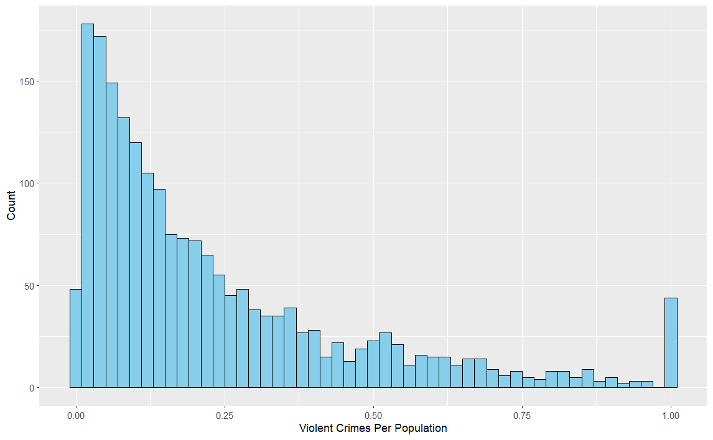

# Violent Crime in U.S. Communities

*Exploratory and Predictive Analysis using Generalized Additive Models
(GAMs)*

## 📌 Project Overview

This project investigates the socio-economic and housing-related drivers
of violent crime across U.S. communities using the **UScrime2 dataset**,
which merges:

-   **1990 U.S. Census** socio-economic indicators  
-   **1995 FBI Uniform Crime Reporting (UCR)** program crime data

The analysis focuses on:

-   Understanding relationships between **violent crime rates** and
    community-level predictors.  
-   Handling missing data via **multiple imputation** (`mice` package in
    R).  
-   Building both **inference** (explanatory) and **predictive**
    models.  
-   Identifying key socio-economic and housing factors associated with
    crime.

------------------------------------------------------------------------

## 📊 Dataset

-   **Observations**: 1,994 communities  
-   **Variables**: 67 predictors + 1 target (violent crime rate)  
-   **Target**: `ViolentCrimesPerPop` (per capita violent crimes)

Predictors include:

-   Economic indicators (poverty, income, unemployment, assistance)  
-   Housing conditions (vacancy, rent, plumbing, housing stability)  
-   Education (% high school grads, % with bachelor’s or more)  
-   Demographics (age, family structure, race)  
-   Population characteristics (density, urbanization, transit use)

------------------------------------------------------------------------

## 🛠 Methodology

1.  **Data Preprocessing**
    -   Normalized numeric variables  
    -   Outlier capping  
    -   Removed identifiers (`state`, `communityname`)
2.  **Missing Data**
    -   Handled via **Multiple Imputation by Chained Equations
        (MICE)**  
    -   Example trace & density plots:  
          
        
3.  **Multicollinearity**
    -   Variance Inflation Factor (VIF) analysis  
    -   Removed highly collinear variables
4.  **Modeling Approaches**
    -   Linear regression (raw & log-transformed response)  
    -   Generalized Additive Models (GAMs) for non-linearities  
    -   Variable selection via Best Subset and shrinkage in GAMs

------------------------------------------------------------------------

## 🔍 Key Findings

-   **Urbanization**, **divorce rates**, and **working mothers with
    young children** strongly linked to higher crime.  
-   Interactive effects showed:
    -   **Youth presence × Household size**: crime higher in small
        households with many youth.  
    -   **Residential stability × Phone access**: stable but
        disconnected communities had higher crime.  
    -   **Low education × Unemployment**: sharp increase in crime when
        both disadvantages co-occur.  
    -   **Urbanization × Density × Transit**: transit protective in
        low-urban areas, less effective in dense cores.

-   **Predictive Model**: Final GAM explained \~68% of variance with
    good accuracy:
    -   RMSE ≈ 0.136  
    -   MAE ≈ 0.08

------------------------------------------------------------------------

## 📈 Results

-   GAMs provided a **better fit** than linear models.  
-   Predictor effect and interaction plots revealed nuanced
    socio-economic drivers of violent crime.  
-   Final GAM was **parsimonious, generalizable, and interpretable**.

------------------------------------------------------------------------

## ⚠️ Limitations

-   Missing variables: policing, social cohesion, community programs.  
-   Sparse data in extreme ranges (e.g., high unemployment + low
    education).  
-   State-level clustering not fully modelled.  
-   GAMs less interpretable than linear models.

------------------------------------------------------------------------

## 🚀 Future Work

-   Incorporate **random effects** for state-level variation.  
-   Apply **spatial GAMs** to capture geographic clustering.  
-   Include additional covariates (e.g., policing, social capital).  
-   Explore **temporal trends** in violent crime.

------------------------------------------------------------------------

## 🧰 Tech Stack

-   **Language**: R  
-   **Packages**:
    -   `mice` (multiple imputation)  
    -   `mgcv` (Generalized Additive Models)  
    -   `leaps` (best subset selection)  
    -   `ggplot2`, `vis.gam` (visualizations)

------------------------------------------------------------------------

## 📂 Repository Structure

    uscrime/
    │── data/           # UScrime2 dataset
    │── scripts/        # R scripts for EDA, modeling, visualization
    │── figures/        # Images used in README (EDA, GAM effects, predictions)
    │── README.Rmd      # Project overview (this file)

------------------------------------------------------------------------
